

  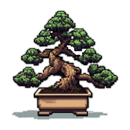

# Welcome to Bonsai!

Bonsai is a 3D voxel-based engine built with the intention of writing both
fast-paced arcade games and tile/turn-based RPGs

Bonsai, and nearly all it's dependencies, are written completely from scratch.
One external dependency is the C runtime library for program startup. I have a
back-burner task to remove the CRT entirely, though it's unclear when/if I'll
get around to it.

The only requirements to build and run Bonsai are an OpenGL 3.3+ driver, C++
compiler, and a few appropriate system headers.

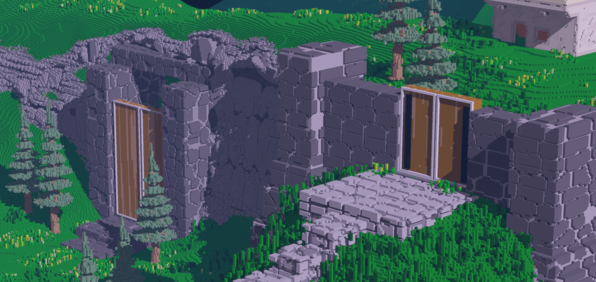

# Quickstart

Grab pre-built binaries & assets from the [Latest Releases](../../releases/latest)
for your platform of choice (as long as it's Windows or Linux ;)

## Build from Source

See the docs on the [build process](docs/01_build_process.md).

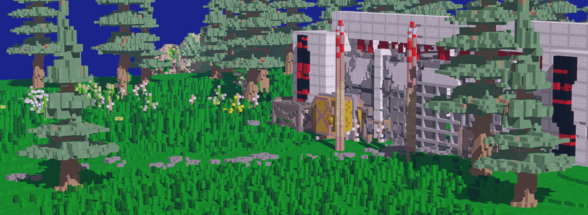

# Feature Sets

## Renderer

* Deferred Shading
* HDR Lighting
* Order-independant Transparency
* Lighting Bloom
* Shadow Mapping
* Screen Space Ambient Occlusion

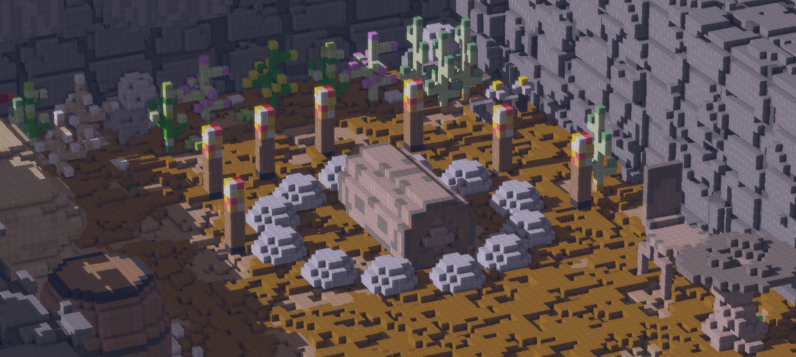

## Engine

* Hot Shader & Game-code Reloading
* Async Job System
* Entities
* Collision
* Transparent & Emissive Particles
* UI Framework
* Asset Loaders
* Primitive Physics

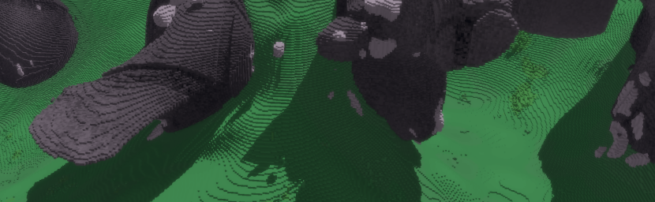

## Terrain Generation

* Fully programmable GPU-based terrain generation
* Batteries-included library of pre-built terrain shaders
* 1D, 2D and 3D noise library
* Terrain derivitives available in second-stage terrain "decoration"

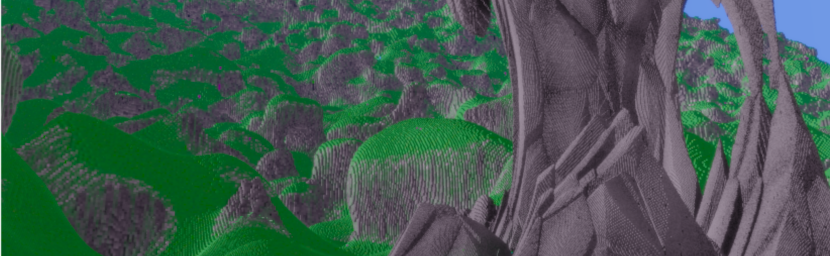

## Editing

* CSG-like SDF world editing
* Library of primitive shapes (sphere, rectangular prism, pyramid, cone, etc)
* SDF brush-based texturing of primitives

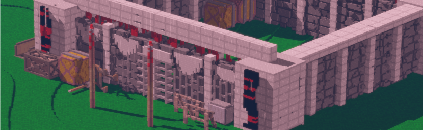

## SDF Brushes

* Layer-based brush GUI
* (coming soon) Fully programmable custom brush shaders

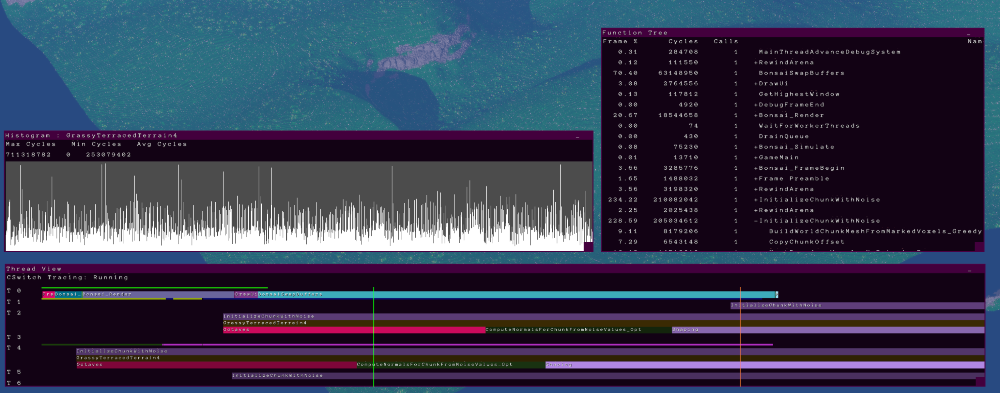

## Performance Profiler

* Manual Instrumentation
* Memory allocation tracing
* Per frame call-graph tracing
* Context Switches (windows only)
* Physical Core  (windows only)

# Gallery

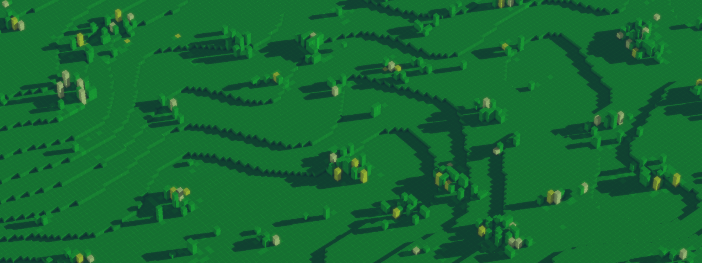

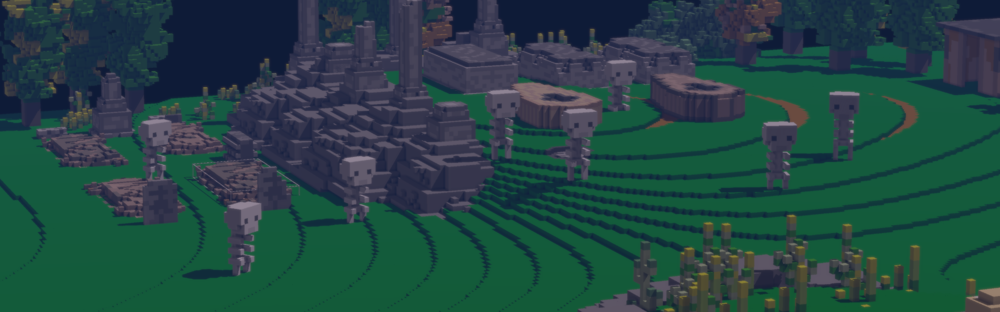

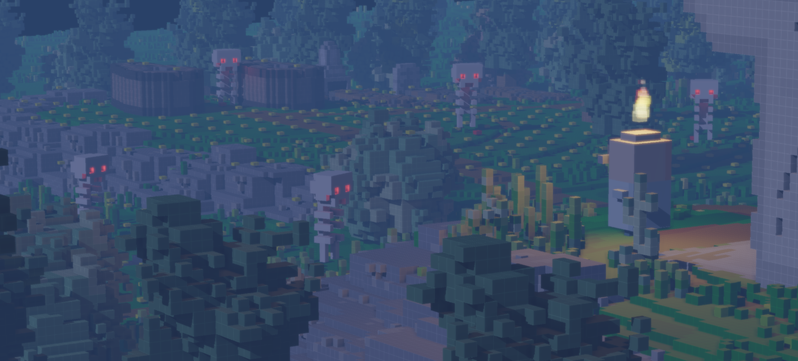

# Wishlist

-------------------------------------------------------------------------------
## Renderer

[ ] SSR : https://lettier.github.io/3d-game-shaders-for-beginners/screen-space-reflection.html

[ ] Screen-space lines : https://mattdesl.svbtle.com/drawing-lines-is-hard

[ ] Better shadows : https://developer.nvidia.com/gpugems/gpugems3/part-ii-light-and-shadows/chapter-8-summed-area-variance-shadow-maps

[ ] Screen Space Shadows : https://panoskarabelas.com/posts/screen_space_shadows/

[ ] Motion Blur : https://developer.nvidia.com/gpugems/gpugems3/part-iv-image-effects/chapter-27-motion-blur-post-processing-effect

[ ] TAA?

[ ] FXAA : http://blog.simonrodriguez.fr/articles/2016/07/implementing_fxaa.html

[ ] Water : https://www.youtube.com/watch?v=5yhDb9dzJ58

[ ] Fluids : https://andrewkchan.dev/posts/fire.html

[ ] Remove meshing entirely? https://www.youtube.com/watch?v=4xs66m1Of4A

[ ] Lumen-style GI screen-space radiance caching : https://www.youtube.com/watch?v=2GYXuM10riw

-------------------------------------------------------------------------------
## Terrain

[ ] Erosion simulation
* https://inria.hal.science/hal-01262376/document
* https://xing-mei.github.io/files/erosion.pdf
* https://nickmcd.me/2020/04/15/procedural-hydrology/

[ ] Biomes
* https://en.wikipedia.org/wiki/Holdridge_life_zones

[ ] Meshing
* Isotropic surface meshing
* https://graphics.stanford.edu/courses/cs164-10-spring/Handouts/isotropic.pdf
* https://inria.hal.science/inria-00071612/document

-------------------------------------------------------------------------------
## Assets

[ ] MCA importer
* https://github.com/GabeRundlett/gvox/blob/old/src/formats/minecraft.cpp

[ ] Sound : mp3, ogg, ..? decompresser

-------------------------------------------------------------------------------
## Datastructures

[ ] Better low-discrepency sequences : https://blog.demofox.org/2017/05/29/when-random-numbers-are-too-random-low-discrepancy-sequences/

[ ] Better disk/sphere sampling patterns : https://extremelearning.com.au/how-to-generate-uniformly-random-points-on-n-spheres-and-n-balls/

[ ] Better hash function! : https://nullprogram.com/blog/2018/07/31/

[ ] Better GPU hashing! : https://arugl.medium.com/hash-noise-in-gpu-shaders-210188ac3a3e

[ ] Hash-trie as alternative to a table : https://nullprogram.com/blog/2023/09/30/

[ ] Octree ? https://graphics.tudelft.nl/Publications-new/2020/CBE20/ModifyingCompressedVoxels-main.pdf

[ ] Better floating-point rng : https://www.corsix.org/content/higher-quality-random-floats

[ ] Better greedy meshing? https://www.youtube.com/watch?v=4xs66m1Of4A

[ ] More interpolation goodies : https://paulbourke.net/miscellaneous/interpolation/

## Goodies

[ ] Better (faster) Sin/Cos ? https://www.shadertoy.com/view/432yWW

[ ] Look into using this Intel tooling for dual CPU/GPU world-gen?
    https://www.intel.com/content/dam/develop/external/us/en/documents/spir-vtointe-ispcgpu-compute-on-the-cpu.pdf
    https://ispc.github.io/

-------------------------------------------------------------------------------
## Profiler

[ ] Improve the ETW layer : https://github.com/bombomby/optick/blob/master/src/optick_core.win.h

[ ] GPU Profiling : https://www.khronos.org/opengl/wiki/Query_Object

